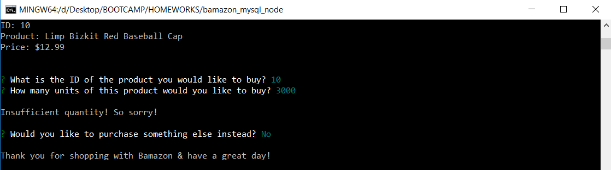

# Node/MySQL "Bamazon" Shopping App

**Inventory displayed upon first running the app**

**Result after user makes a purchase**

**Result after a purchase cannot be completed due to item not being in stock**

 [View Video Demonstration](https://tinytake.s3.amazonaws.com/pulse/dennisb23/attachments/7680718/TinyTake27-04-2018-01-03-00.mp4) |
 [View Live!](https://bereznd1.github.io/bamazon_mysql_node/bamazonCustomer.js)

## Brief Description

The **Node/MySQL "Bamazon" Shopping App** displays information on an inventory of items that have been populated within a **MySQL** database. Users can choose which item they would like to purchase, as well as the amount of individual units. If there is a sufficient quantity in stock to complete the purchase, the MySQL database is updated to reflect the purchase & the app displays the total cost for the user. The user can then choose to make another purchase or close out the app. If there is not a sufficient quantity in stock of whichever item the user wants to buy, a message is displayed that informs the user of this situation & he/she is then prompted about whether they would like to make another purchase or not.

## How This Was Achieved
First, I installed & "required" 2 crucial **NPM packages** using **Node**: **inquirer** & **mysql**. I then used the mysql package to connect to the database which I had previously created with **MySQL Workbench** & had populated with a number of sample items. 

Upon connecting with the database, the app runs a separate function that queries the necessary columns from the database table for each item & displays this information for the user. Users are then prompted, using the inquirer package, to enter the ID of the item they wish to purchase & the amount of that item they would like. The database is then queried once more, this time just to select the stock quantity of the item the user desires. An **if-else** statement is run to check whether the stock quantity is *greater than* or *equal to* the amount that the user wishes to purchase. 

If this turns out to be true, the mysql package connects to the database and updates the stock quantity of the item in question to reflect the purchase that has just been made. Another query is run to select the price of the item, and this price is multipled by the user's desired amount in order to find the total cost of his/her purchase. This cost is then displayed for the user. At this point, users are prompted about whether or not they want to make another purchase. If they select "yes", then the app basically starts over by running the initial function that displays all the items in stock & asks users which one they would like to buy. If users select "no", then the app displays a thank you message for shopping with Bamazon.

If the original **if** statement that checks if the stock quantity is sufficient turns out to be false, then the app displays an apology message for insufficient quantity and asks users if they want to make another purchase or not. Similary to what is described in the previous paragraph, the app will either restart & display all the items again, or it will simply show a thank you message, depending on what the user selects.

